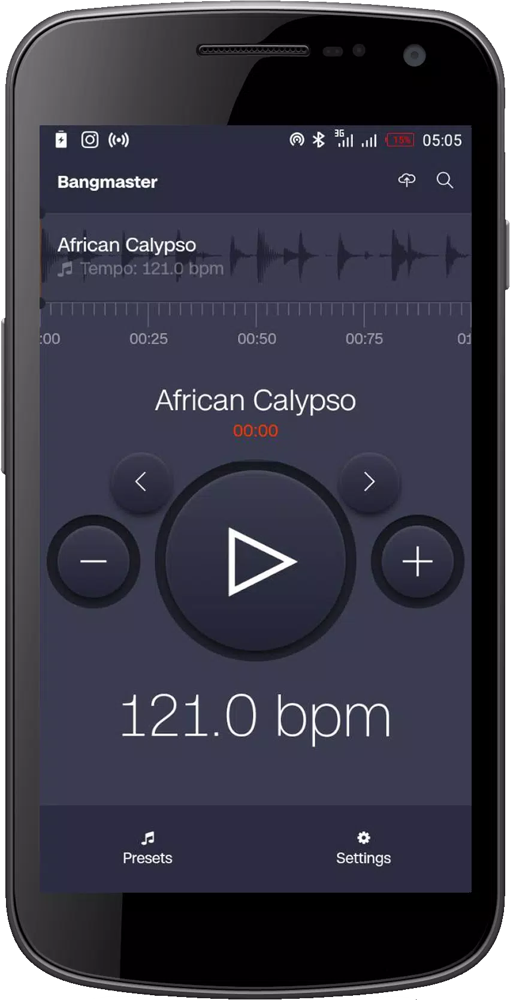
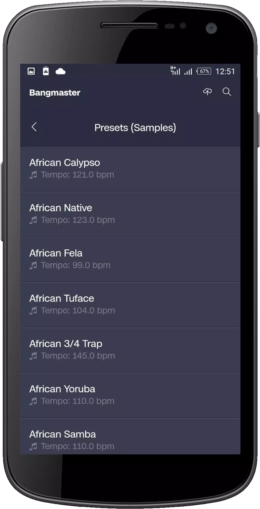
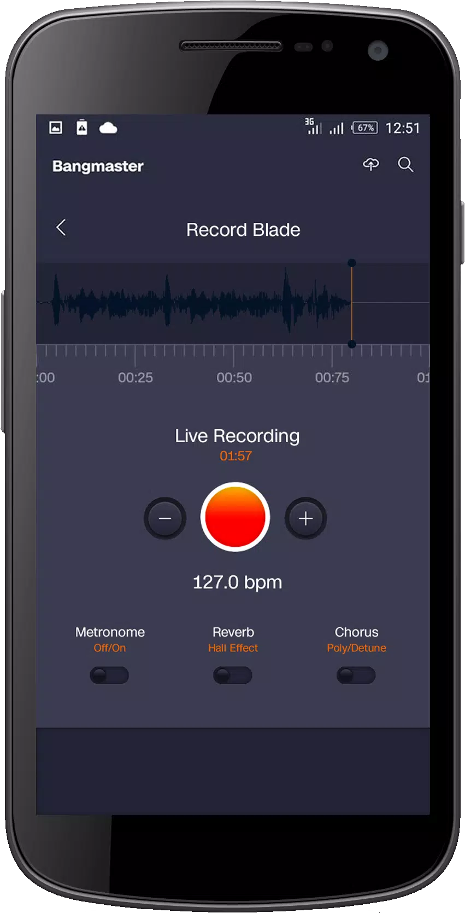

# bangmaster

The Ultimate Drum Loops Machine & Sampler for live performance and recording.

Bangmaster provides an easy and alternative way to help drummers perform their favourite tracks using loops. Ideal for concert, live, church, school, military performances and so on.

---

<table>
  <tr>
    <td>
      
    </td>
    <td>
      
    </td>
  </tr>
</table>

---

<table>
  <tr>
    <td>
      
    </td>
    <td>
      
    </td>
  </tr>
</table>

## Why BangMaster?

It provides an alternative and easy drum sampler to assist with backtracks for performances.

You don't have to carry your laptop anymore for backtrack performances. Save yourself the stress and also protect your laptop against theft during transit.

## Project Structure

```bash
- .github        # CI/CD jobs.
- .vscode        # VS Code settings.
- assets         # Assets folder.
  - fonts           # Font files.
  - images          # Image files.
- src            # JS source files.
  - components      # Reusable components.
  - core            # Core components.
  - screens         # Screen components.
  - utils           # Utility functions.
- tests          # Test files.
```

## Requirements

- Yarn `v7.4|v8.0`
- [Expo Go](https://expo.dev) for mobile builds.
- Node `v20+`, [Node.js](https://nodejs.org) for dependency management.

## Setup

- Clone the repository `git clone https://github.com/badasswp/bangmaster.git`.
- Run `yarn install` to install JS dependencies.
- Run `yarn start` to compile using Expo.

## Testing

```bash
# Run JavaScript tests.
yarn test
```

## Linting

```bash
# Run linting checks.
yarn lint
yarn lint:fix
```
